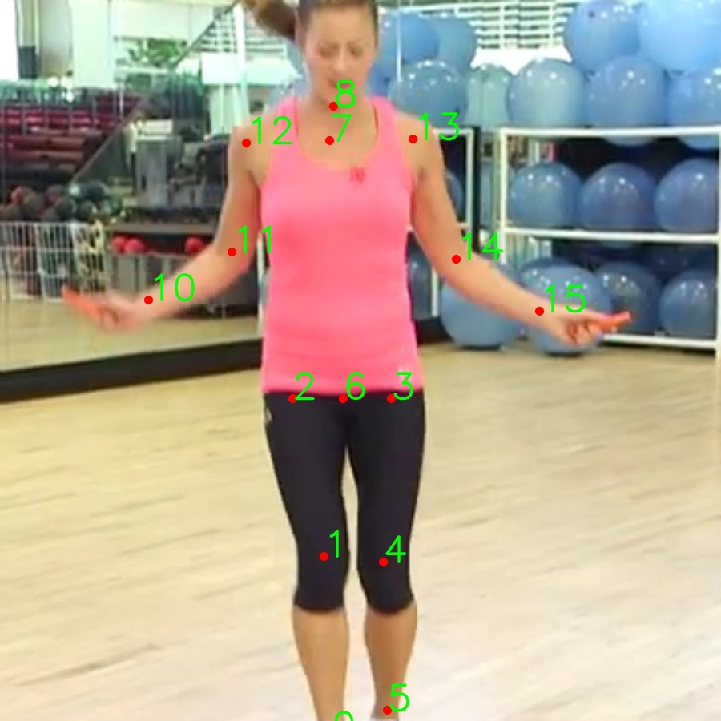
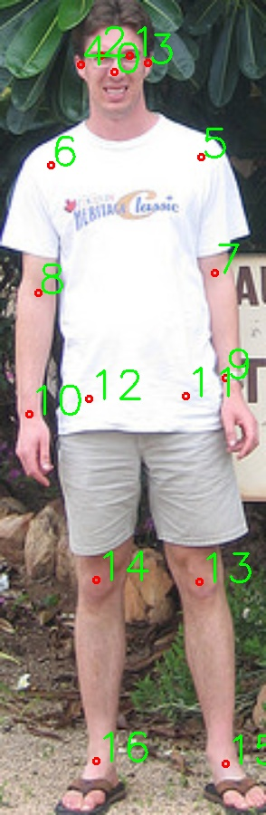
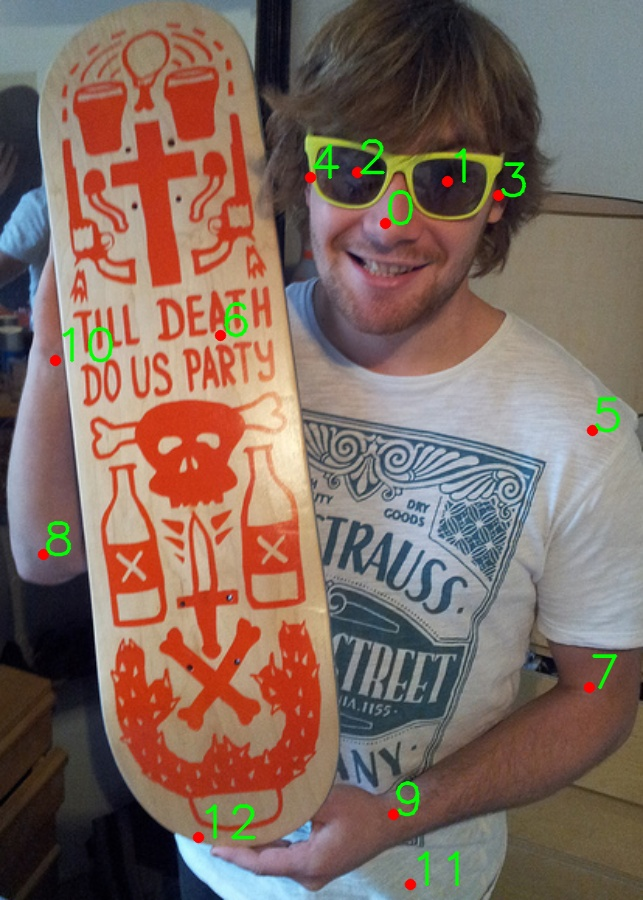

# Human Pose Estimation datasets annot format

**Pelease refer to this article for further guide/cookbook of datasets and download of AIC(AI Challenger):**

[2D多人姿态估计入门指南(0)：数据集使用指南（内含 AI Challenger/AIC 下载与使用指南）](https://zhuanlan.zhihu.com/p/485949832)

## 1. MPII
+ 坐标点：
  >[[738.0, 538.0], [734.0, 440.0], [717.0, 355.0], [770.0, 355.0],
  >     [766.0, 443.0], [768.0, 523.0], [744.0, 355.0], [737.0, 216.0], 
  >     [739.0207, 197.2623], [745.9793, 132.7377], [639.0, 302.0], 
  >     [684.0, 276.0], [692.0, 217.0], [782.0, 215.0], [805.0, 280.0], 
  >     [850.0, 308.0]]

+ 输出图：

  

## 2. COCO
+ 数据格式
    > "joint_vis": { 0: "invisible", 1: "occlude", 2: "visible" }  
    
    > "keypoints": {
            0: "nose",
            1: "left_eye",
            2: "right_eye",
            3: "left_ear",
            4: "right_ear",
            5: "left_shoulder",
            6: "right_shoulder",
            7: "left_elbow",
            8: "right_elbow",
            9: "left_wrist",
            10: "right_wrist",
            11: "left_hip",
            12: "right_hip",
            13: "left_knee",
            14: "right_knee",
            15: "left_ankle",
            16: "right_ankle"
        },
  
  > "skeleton": [[16, 14], [14, 12], [15, 13], [13, 11], [12, 11], [6, 12], [5, 11], [6, 5], [6, 8],
             [8, 10], [5, 7], [7, 9], [3, 1], [1, 0], [0, 2], [2, 4]]

### 示例1：确认特征点位置
+ 坐标点
    > [132,261,2,139,254,2,126,254,2,147,257,2,117,258,2,171,299,2,104,303,2,177,351,2,98,360,2,182,398,2,94,414,2,164,406,2,121,407,2,170,489,2,124,488,2,182,570,2,124,569,2]

+ 输出图

  

### 示例2：确认可见性标注格式
+ 坐标点
    > [268, 204, 2, 308, 177, 2, 250, 171, 2, 341, 186, 2, 220, 174, 2, 401, 337, 2,
                 162, 276, 1, 399, 502, 2, 48, 417, 2, 273, 584, 2, 56, 292, 2, 284, 629, 2,
                 148, 599, 1, 0, 0, 0, 0, 0, 0, 0, 0, 0, 0, 0, 0]

+ 输出图

  

## 3. AI Challenger
+ 数据格式
    > "joint_vis": { 1: "visible", 2: "occlude", 3: "invisible"}
    
    > "keypoints": { 0: "right shoulder", 1: "right elbow", 2: "right wrist", 3: "left shoulder", 4: "left elbow", 5: "left wrist", 6: "right hip", 7: "right knee", 8: "right ankle", 9: "left hip", 10: "left knee", 11: "left ankle", 12: "head tops" 13: "upper neck" }
  
  > "skeleton": [
            [12,13],[13,0],[0,1],[1,2],[13,3],[3,4],[4,5],
            [13,6],[6,7],[7,8],[13,9],[9,10],[10,11]]

### 示例1：确认特征点位置
+ 坐标点
    > [400, 183, 1, 380, 319, 1, 358, 416, 1, 559, 217, 1, 557, 357, 1, 590, 294, 1,
                                 428, 444, 1, 394, 664, 1, 0, 0, 3, 511, 445, 1, 504, 662, 1, 0, 0, 3, 466, 51, 1,
                                 485, 179, 1]

+ 输出图

  

### 示例2：确认可见性标注格式
+ 坐标点
    > [235, 455, 2, 183, 678, 2, 204, 470, 1, 514, 387, 1, 433, 660, 1,
                                                     219, 715, 1, 389, 826, 2, 0, 0, 3, 0, 0, 3, 555, 813, 1, 0, 0, 3,
                                                     0, 0, 3, 191, 183, 1, 324, 395, 1]

+ 输出图

  
